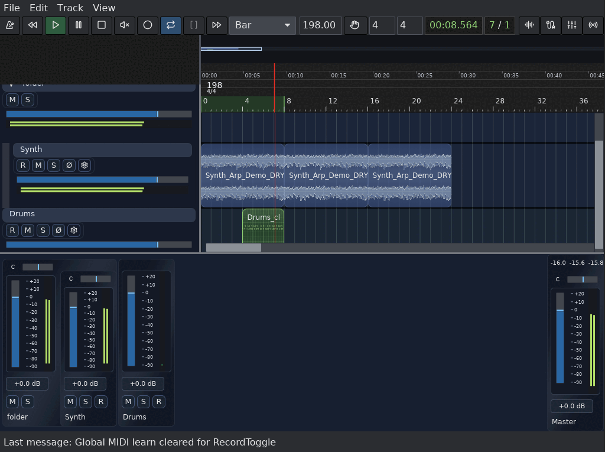

# Maolan

[](https://crates.io/crates/maolan)


Maolan is a Rust DAW focused on recording, editing, routing, automation, export, and plugin hosting.

[maolan.rs](https://maolan.rs)



## Platform Notes

- Unix builds support CLAP, VST3, and LV2.
- Windows builds support CLAP and VST3.
- Plugin compatibility is host-dependent and should be treated as evolving rather than guaranteed.

## Build

### Prerequisites

- Rust toolchain (edition 2024)

For Unix audio integrations, install platform libraries as needed (for example `jack`, `alsa`, `rust`, and `cargo` where applicable).

### Compile and run

`maolan/` is a Cargo workspace. Build from that directory:

```bash
cd maolan
cargo build --workspace --release
cargo run --release
```

### Debug logging

```bash
cd maolan
cargo run --release -- --log-level debug
```

## Project Notes

- Preferences are stored in `~/.config/maolan/config.toml`.
- Session templates are stored under `~/.config/maolan/session_templates/`.
- Track templates are stored under `~/.config/maolan/track_templates/`.
- Autosave snapshots are stored under `<session>/.maolan_autosave/snapshots/`.

## Status

Maolan is under active development. Behavior and UI details may evolve between commits.
